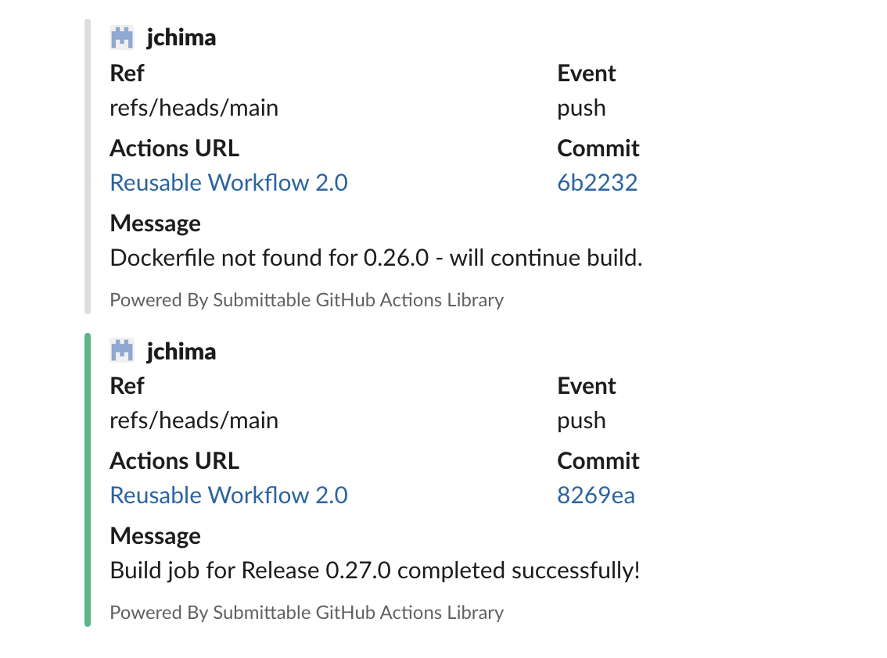

# Submittable Universal Reusable Workflow 2.0

### 💻Runtime Environment: ### 
```Self hosted with Kubernetes Runners (Ubuntu 20.4) running internally in EKS```
### 💻K8 runner version: ### 
```2.286.0```
### 💻Python version: ###
```3.6```
### 💻NodeJS version: ###
```15.x```
### 💻.Net version: ###
```5.0.x```
### ⚙️GitHub Actions: ###
```
+++++++++++++++Docker
+++++++++++++++QEMU
+++++++++++++++Docker Buildx
+++++++++++++++GitHub Container Registry
+++++++++++++++File Checker
+++++++++++++++Nodejs
+++++++++++++++Python
+++++++++++++++.Net
+++++++++++++++SemVer
+++++++++++++++Bumb and Tag version
+++++++++++++++Docker Publish to GitHub Registry
+++++++++++++++Slack
```
### 👷Pipeline workflow: ###
```
+++++++++++++++Choose available runner (self-hosted)
++++++++++++++++Checkout repo
+++++++++++++++++Set up QEMU
+++++++++++++++++Set up Docker Buildx
++++++++++++++++Login to GitHub Container Registry
++++++++++++++++Set Build Type using file extensions (Nodejs, Python, .Net)
+++++++++++++++++Run Tests (if test files are present)
++++++++++++++++Sonar Scan for vulnerabilities (Output in Sonar UI). Slack alert coming soon...
+++++++++++++++++Bump version and push tag
+++++++++++++++++Extract source branch/pr name
+++++++++++++++++Extract metadata (tags, labels)
++++++++++++++++Build, Tag and Push Docker Image
+++++++++++++++++Slack Notification - On Success
+++++++++++++++++Slack Notification - Dockerfile not Present
+++++++++++++++++Slack Notification - On Failure
```

### ✏️Pipeline workflow Diagram ###


## 💾How to Install in project

1. Create folder ```.github/workflows``` in the root directory of your repo

2. Create file ```ci.yml``` and copy code from ```caller-examples/universal-ci-caller.yml``` and save.

3. Edit file ```ci.yml``` and change ```repo_name``` value in line 19 of ```ci.yml``` file to the project name. This will be consumed by Sonar scanner

4. Save and Create PR

5. Click ```Actions``` tab within repository and confirm that workflow is running successfully


6. Sonarqube Scan


7. Feedback is sent to Slack ```builds``` channel once build is completed. Notification occurs on PR to ```main``` branch



## ⚙️Manual Run
1. Go to your Actions tab and click on the workflow eg: ```Resuable Workflow 2.0```


2. Click on ```Run workflow``` drop down menu and choose which branch you want to run manually


## ⚙️⚙️Multi-Project Build
For Multi-project build, see example at [here](./caller-examples/multi-pipeline-example-workflow.yml)
This example is for more than one project that is living in the same repo. The only difference from this workflow and the universal-ci-caller.yml is that it builds more than one project in a chronological order while implementing the respective Docker tags and SemVer for each build. Example of successful build can be found [here](https://github.com/submittable/funds-distribution-tool/actions/runs/1849806579)